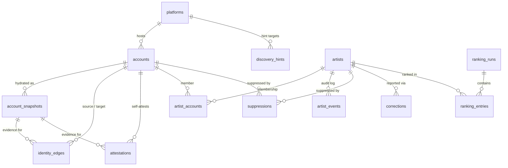

# Schema design

Postgres schema for the No-AI Artist Directory. The directory is an
entity-resolution + labeling system: artists' own self-published links are
resolved into identity clusters, and "no AI" is displayed strictly as the
artist's self-attestation.

Hard rules the schema enforces structurally:

1. Identity claims are **edges with provenance**, never merged truth.
2. Booru data (and any third-party assertion) is a **discovery hint only** and
   never appears in publishable lineage.
3. `same_handle` similarity **never auto-merges** (impersonation is common).
4. Twitter only via the paid official API; **Instagram is display-only** and
   never fetched.
5. We **never publish an AI-use accusation** as fact.

## ERD

`discovery_hints` is deliberately an island: nothing publishable joins it.
`directory_entries` (a view over artists/artist_accounts/accounts/platforms/
attestations/suppressions) is the only publish surface, and
`scripts/smoke.sql` asserts via `pg_depend` that it has no dependency on
`discovery_hints`.

## Table-by-table

| Table | Role |
|---|---|
| `platforms` | Seeded lookup with per-platform policy (`display_only`, kind incl. `link_hub`) |
| `accounts` | One row per (platform, native identity); handles are mutable, `native_id` is truth |
| `account_snapshots` | Append-only hydration observations; all extraction re-runs from these |
| `identity_edges` | Directed artist-published claims with evidence snapshot FKs; `claim` separates `same_person` (clusters) from `related` (partner/pfp-artist/bare mention — graph only, never merges) |
| `discovery_hints` | Quarantined third-party assertions (boorus etc.), pending verification |
| `artists` | Stable public entities (slug, region, status, `merged_into` pointer) |
| `artist_accounts` | Cluster membership with confidence tier and open/closed history |
| `artist_events` | Append-only audit of merges, splits, overrides |
| `attestations` | Per-account no-AI signals with first/last seen |
| `content_flags` | Per-account NSFW/18+ self-signals (🔞/R-18/NSFW bio markers, Bluesky self-labels), same model as attestations; derived per-artist `nsfw` in the publish view |
| `review_items` | Human review queue for clustering decisions (prominent-target attaches, artist merges) |
| `suppressions` | Opt-outs and delistings; block publish and re-discovery |
| `corrections` | Community report queue with human resolution |
| `ranking_runs` / `ranking_entries` | Recorded stratified cuts with border-zone flags |
| `api_usage` | Pay-per-use spend ledger (budget caps are queryable) |
| `directory_entries` | View: the only publish surface |

## Design tradeoffs

### 1. Stable artist IDs vs. recomputed clusters

Clusters change as edges appear and retract, but public URLs need stable
slugs, and moderation state (suppressions, review decisions) needs a stable
anchor. Chosen: a materialized `artists` table with a `merged_into` pointer
and membership history in `artist_accounts` (rows are closed via `removed_at`,
never deleted). Merges keep the losing row so its slug can redirect; splits
close memberships and open new ones, all logged in `artist_events`. A pure
view over connected components would be simpler but leaves slugs and
moderation state unanchored across recomputes.

### 2. Evidence as snapshot FKs vs. bare URLs

Every edge and attestation points at the stored `account_snapshots` row it was
extracted from. Storage cost is trivial at this scale (~50k accounts ×
quarterly hydration), and it buys two things: extraction is a pure,
re-runnable function of stored data (parser improvements re-apply to history),
and provenance is a real chain — "we saw this in *their* bio on date X", which
is the trust story this audience requires.

### 3. Reciprocity computed, not stored

A stored `reciprocal` evidence type goes stale the moment one side edits their
bio. Instead we store two directed edges and compute reciprocity at clustering
time. Confidence tiers per the brief: reciprocal pair (including hub-mediated)
= near-proof; one-directional bio link = strong; `same_handle` = weak and
never auto-merged.

### 4. Link hubs as accounts

Linktree/Carrd/potofu.me/lit.link pages are rows in `accounts` on platforms of
kind `link_hub`, not a separate table. The graph stays uniform: Twitter bio →
Linktree is one edge, Linktree → Pixiv is another. A hub is artist-published
(it appears in their bio), so hub-mediated two-hop links inherit strength, and
hub-mediated reciprocity (Pixiv links back to the same hub) counts as
near-proof.

### 5. One-directional edges and impersonation

The impersonation vector: fakes link *to* a famous artist's real accounts to
borrow credibility. Policy encoded in `artist_accounts.confidence` +
clustering rules: reciprocal auto-merges; a one-directional edge attaches at
`strong` but routes to human review when the *target* account is
high-prominence (that's where impersonation pays); `same_handle` only ever
surfaces as a review suggestion. Human decisions land as `added_by = 'human'`
memberships and `artist_events` rows.

### 6. Attestations per-account, badge derived per-artist

Signals live where they're observed (a bio tag on Twitter, a labeler
subscription on Bluesky, Cara membership). The artist-level badge is derived:
any active signal on any live member account. `first_seen`/`last_seen`/`active`
make signal *removal* first-class — if an artist deletes #NoAI from their bio,
the badge drops at the next refresh instead of lingering as a stale claim we
made on their behalf.

### 7. Hints quarantine as structure, not policy

Boorus (e.g. Danbooru artist entries) are useful discovery hints and
unacceptable provenance. `discovery_hints` has no join path into the publish
view — verification fetches the artist's own bio/hub and, on success, writes
an ordinary `identity_edge` whose evidence is the artist's own snapshot. The
smoke test asserts the view's dependency set excludes `discovery_hints`, so
the rule survives refactors by construction, not discipline.

### 8. Inclusion and consent (product decisions, 2026-07-20)

The directory lists all top-ranked artists; `no_ai_attested` is a displayed
badge, not a gate. Consent is default-list + opt-out: `suppressions` rows
persist independently of artist/account rows, so re-discovery can never
silently re-add an opted-out artist. An accepted `ai_use` correction results
in badge removal or quiet suppression — the schema has no field for publishing
an accusation, on purpose.
